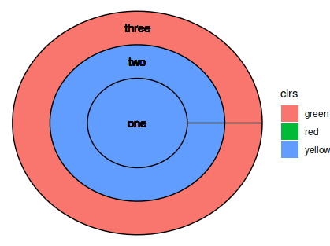

# ggonion

R package for drawing onion diagrams with ggplot2

WIP (Work in progress)

## Usage

```
library(ggonion)

x <- c("one", "two", "three")
clr <- c("red","yellow", "green")
ggonion(x, color = clr)
```



## Install

```
devtools::install_github("i2z1/ggonion")
```
