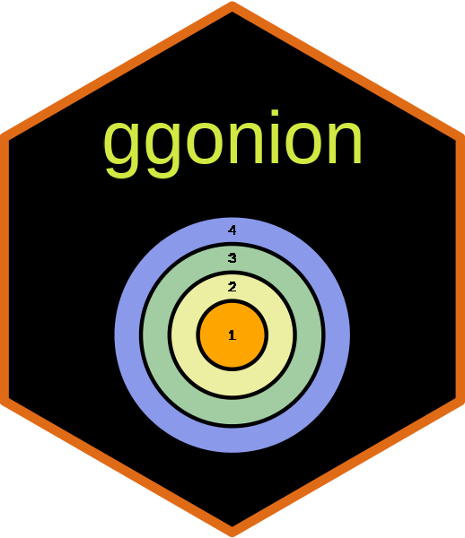

<!-- README.md is generated from README.Rmd. Please edit that file -->

# ggonion 

R package for drawing onion diagrams with ggplot2

WIP (Work in progress)

## Installation

You can install development version if ggonion from Github with

    devtools::install_github("i2z1/ggonion")

## Usage

``` r
library(ggonion)

x <- c("1", "2", "3","4")
clr <- c("orange", "#ecefa2", "#a2cda3", "#8a99e9")
ggonion(x, color = clr)
```

<!-- -->
